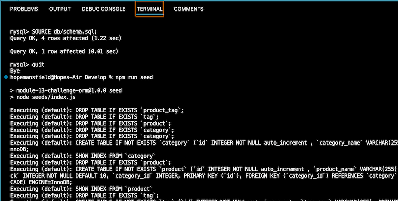
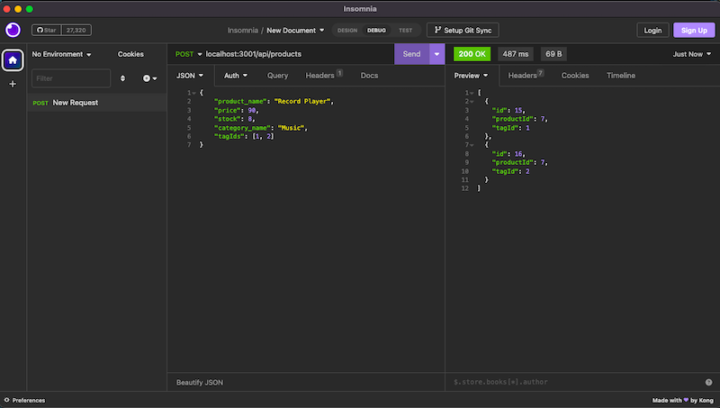

# E-Commerce Back End

## Description

The E-Commerce Back End app is an example of how an e-commerce site works behind the scenes. The app utilizes an Express.js API and Sequelize to interact with a MySQL database. 

## Table of Contents

[Installation](#installation)

[Usage](#usage)

[Contributing](#contributing)

[Questions](#questions)

---

    
## Installation
    
This app requires npm and node.js, as well as the express, mysql, sequelize, and dotenv packages. 

- Use `git clone` to clone the repo to a local folder. 
- Run `npm install` from the command line to install the necessary packages.

This code utilizes a `.env` file that is structured as follows. You will need to create this file to use with your local repo.

      DB_NAME='database'
      DB_USER='user'
      DB_PASSWORD='password' 

- From the `MySql` shell, run:

      SOURCE db/schema.sql;

- Exit the `MySql` shell and seed your database by running:

      npm run seed

---
    
## Usage
    
From the command line, run `npm start` to initiate this app. From the API platform of your choice (`Insomnia` is featured in the video and screenshots), navigate to `localhost:3001/` to begin testing routes.

A video showing a full walk-through of this app's functionality can be viewed [here](https://drive.google.com/file/d/1arZ4UoLK1eupsGwdeoX03Ja2Ft3Vu9WS/view).

---

---

---

## Contributing

For information on how to contribute to a project through forking, please visit the 
GitHub documentation on [Contributing to projects through forking](https://docs.github.com/en/get-started/quickstart/contributing-to-projects).

---

## Questions
    
To ask additional questions about this app, please contact me at hopemansfield@gmail.com.
